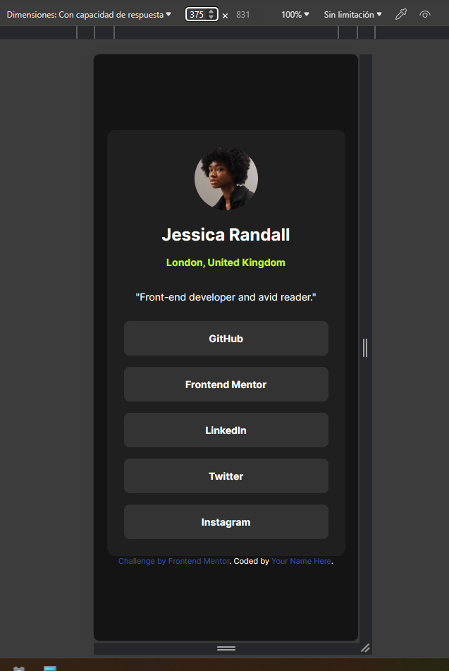

# Frontend Mentor - Social links profile solution

This is a solution to the [Social links profile challenge on Frontend Mentor](https://www.frontendmentor.io/challenges/social-links-profile-UG32l9m6dQ). Frontend Mentor challenges help you improve your coding skills by building realistic projects. 

## Table of contents

- [Overview](#overview)
  - [The challenge](#the-challenge)
  - [Screenshot](#screenshot)
  - [Links](#links)
- [My process](#my-process)
  - [Built with](#built-with)
  - [What I learned](#what-i-learned)
  - [Continued development](#continued-development)
  - [Useful resources](#useful-resources)
- [Author](#author)
- [Acknowledgments](#acknowledgments)

## Overview

### The challenge

Users should be able to:

- See hover and focus states for all interactive elements on the page

### Screenshot

### Links

- Solution URL: [Add solution URL here](https://your-solution-url.com)
- Live Site URL: [Add live site URL here](https://your-live-site-url.com)

## My process

The development of the code was quite clear from the beginning but was hindered by my persistence in trying to modify the color of the cursor and not accepting the reality that I should look for an image similar to the one shown. :)

### Built with

- Semantic HTML5 markup
- CSS custom properties
- Flexbox
- Mobile-first workflow

### What I learned

I learned about cursors, how to modify them, the different types and the limitations I can have if I want to modify them. 

### Useful resources

- [Example resource 1](https://www.flaticon.es/icono-gratis/cursor-de-mano_5781771?term=cursor+de+mano&page=1&position=12&origin=tag&related_id=5781771) - From this page I got the image of the cursor that I then modified with paint :)

## Author

- LinkedIn - (www.linkedin.com/in/spagura)
- Frontend Mentor - [@santiagopagura](https://www.frontendmentor.io/profile/yourusername)

## Acknowledgments

Always my thanks to all those who build Frontend Mentor for providing us with these tools to improve our performance.